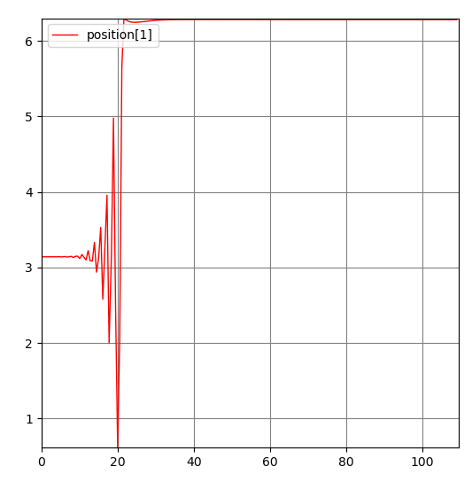
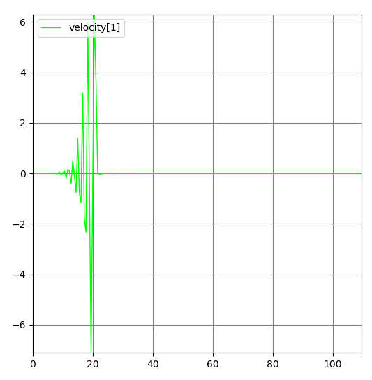
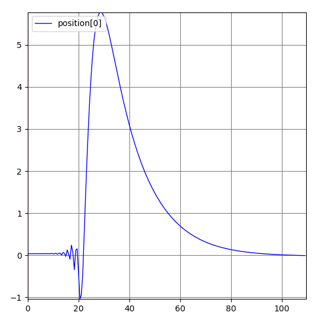
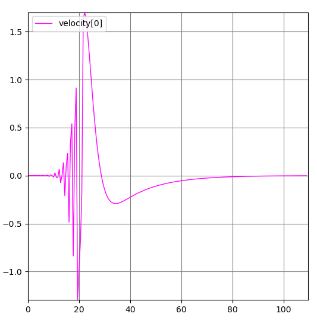
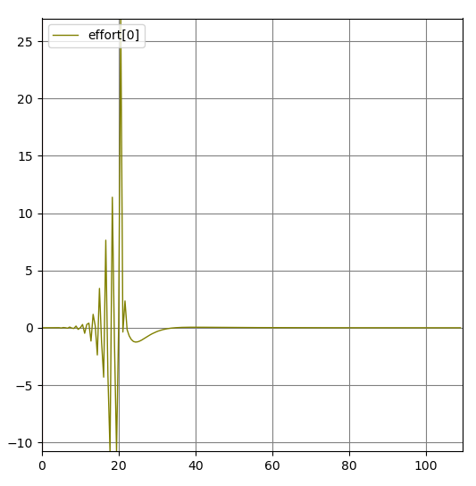

# Hybrid Cart-Pole Controller (ROS + Gazebo)

[](http://wiki.ros.org/noetic)
[](http://gazebosim.org/)
[](https://www.python.org/)

A cart-pole (inverted pendulum) in **ROS Noetic + Gazebo**, swung up from hanging straight down and stabilized upright by a single **hybrid controller**: energy-based swing-up when the pole is far from vertical, switching to a linear state-feedback law once it's close enough to balance directly.

This is the piece a pure LQR controller can't do on its own — LQR is only valid near the upright equilibrium, so getting the pole from hanging (`θ ≈ π`) up to vertical (`θ ≈ 0`) needs a nonlinear strategy first.

---

## How It Works

The controller (`lyapunov.py`) runs one control law that branches on the pole angle:

**Far from upright (`|θ| ≥ 0.11 rad`) — energy shaping:**

Computes the pole's mechanical energy relative to the upright equilibrium,
```
E = ½(I + ¼m₂l²)θ̇² + ½m₂gl(cos θ − 1)
```
and applies an effort proportional to `-k·θ̇·E`, pumping energy into the pendulum on each swing until it has enough energy to reach vertical. Near `θ ≈ ±π/2` (where the swing-up law is momentarily singular), a small fixed push (`2·sign(θ)`) is applied instead to carry the pole through that point.

**Near upright (`|θ| < 0.11 rad`) — linear state feedback:**

Switches to a fixed linear feedback law (the same style of gain used by a standalone LQR controller):
```
effort = 55.8868·θ + 27.818·θ̇ + 0.0316·x + 0.5631·ẋ
```
which holds the pole balanced once it's close enough to vertical for the linear approximation to be valid.

`pub_command.py` is included alongside it as a standalone pure-LQR controller (no swing-up) — the same linear law without the energy-shaping stage, useful for comparing against the hybrid approach or for scenarios that already start upright.

## Results

Starting from the pole hanging straight down (`θ ≈ π`), the plots below show the swing-up and catch:

<table>
<tr>
<td align="center"><b>Pole Angle</b><br></td>
<td align="center"><b>Pole Angular Velocity</b><br></td>
</tr>
<tr>
<td align="center"><b>Cart Position</b><br></td>
<td align="center"><b>Cart Velocity</b><br></td>
</tr>
<tr>
<td align="center" colspan="2"><b>Control Effort</b><br></td>
</tr>
</table>

The pole angle plot shows the signature of this controller: a growing oscillation as energy is pumped in (the swing-up phase), then a sharp catch and settle once the switch threshold is crossed and the linear law takes over. `video.mp4` shows the same run in Gazebo.

## Repository Structure

```
hybrid-cartpole-controller-ros/
├── src/
│   └── cart_pole/src/                # catkin workspace packages
│       ├── robot_description/        # URDF/xacro model, DAE & STL meshes
│       ├── robot_control/            # ros_control controller definitions
│       ├── robot_launch/             # Gazebo world + top-level launch file
│       └── commander/
│           ├── scripts/
│           │   ├── lyapunov.py       # the hybrid controller (swing-up + switch)
│           │   ├── pub_command.py    # standalone LQR controller, for comparison
│           │   └── test              # leftover duplicate script, not part of the pipeline
│           └── launch/commander.launch
├── plots/                            # state/effort plots for the swing-up run
├── video.mp4                         # Gazebo recording of the swing-up
└── README.md
```

## Getting Started

### Prerequisites
- ROS Noetic
- Gazebo 9+ (bundled with `gazebo_ros`)
- Python 3.8 with `numpy`

### Build and run

```bash
git clone https://github.com/haidar996/hybrid-cartpole-controller-ros.git
cd hybrid-cartpole-controller-ros
catkin_make
source devel/setup.bash
roslaunch robot_launch launch_simulation.launch
```

This spawns the cart-pole in Gazebo and starts the hybrid controller (`lyapunov.py`) by default. To run the standalone LQR controller instead:

```bash
rosrun commander pub_command.py
```

`roslaunch commander commander.launch` is a second, standalone way to bring up the hybrid controller without also launching the Gazebo world — useful if you already have a simulation running.

## Author

**Haidar Saad**
